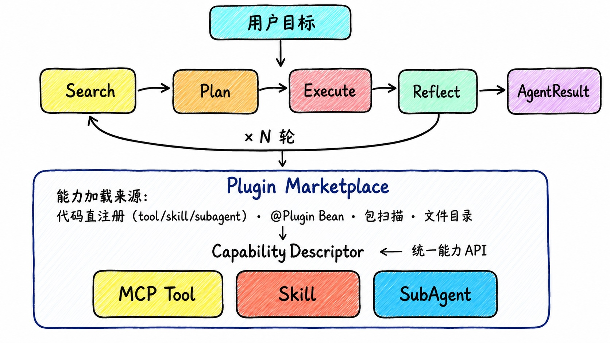

<p align="center">
  <h1 align="center">⚡ Regnexe</h1>
  <p align="center"><b>面向 Java / Spring Boot 的多轮 Agent 编排框架</b></p>
  <p align="center">用统一插件市场管理 Tool、Skill 和 Sub-Agent，让 Agent 能搜索、规划、执行并反思。</p>
</p>

<p align="center">
  <a href="https://central.sonatype.com/artifact/io.github.flower-trees/regnexe-agent"></a>
  <a href="LICENSE"></a>
  
  
</p>
<p align="center">
  简体中文 | <a href="README.md">English</a>
</p>

---

Regnexe 不是一次 LLM 工具调用的简单封装。它围绕一个目标运行完整的 **Search -> Plan -> Execute -> Reflect** 循环：先从插件市场中搜索可用能力，再规划执行步骤，调用工具或子 Agent，最后根据结果判断是否完成、重试、继续规划或交给人工处理。



## 为什么用 Regnexe

- **多轮推理**：Agent 会基于中间结果继续规划，而不是只调用一次工具。
- **统一能力市场**：Java Bean、扫描类、脚本目录、数据库动态定义都可以转成 `CapabilityDescriptor`。
- **插件化扩展**：业务能力可以独立增删，不需要改 Agent 主流程。
- **暂停与恢复**：运行中的任务可被 `pause()` 中断，并通过 `resume()` 带着新上下文继续。
- **三层记忆**：会话历史、任务执行账本、单次工具调用上下文三层独立可替换。
- **Spring Boot 友好**：`RegnexeAgentBuilder` 自动装配，无需 `@EnableXxx` 或 XML 配置。

本文档从"一次工具调用"开始，一层一层往深处讲。每个代码块都对应一个可直接运行的测试，在 [`src/test/java/.../example/readme/ExampleReadme*Test.java`](src/test/java/org/salt/regnexe/agent/core/example/readme) 下。

## 目录

- [1. 快速开始：多个 tool，一个循环](#1-快速开始多个-tool一个循环)
- [2. 进阶：Skill 与 Sub-Agent](#2-进阶skill-与-sub-agent)
- [3. 插件概念与打包](#3-插件概念与打包)
- [4. @Plugin 及其他注解方式](#4-plugin-及其他注解方式)
- [5. 文件系统目录加载](#5-文件系统目录加载)
- [6. Marketplace](#6-marketplace)
- [7. 三层上下文记忆](#7-三层上下文记忆)
- [8. 可观测性](#8-可观测性)
- [9. 暂停与恢复](#9-暂停与恢复)
- [参考文档](#参考文档)

## 1. 快速开始：多个 tool，一个循环

### 添加依赖

```xml
<dependency>
    <groupId>io.github.flower-trees</groupId>
    <artifactId>regnexe-agent</artifactId>
    <version>0.1.2</version>
</dependency>
```

### 配置模型 Key

```yaml
# application.yml
models:
  aliyun:
    chat-key: ${ALIYUN_KEY}
  deepseek:
    chat-key: ${DEEPSEEK_KEY}
```

接口地址已内置。你可以显式指定厂商，也可以只传模型名，让 `DefaultModelProvider` 按模型名前缀自动路由。

### 注册 tool 并运行

`withTool(...)` 直接注册已经构建好的 `Tool` 对象——不需要类，不需要注解，是接入 Agent 最快的路径。代码见 [`ExampleReadme01MultiToolTest`](src/test/java/org/salt/regnexe/agent/core/example/readme/ExampleReadme01MultiToolTest.java)。

```java
Tool weatherTool = Tool.builder()
    .name("get_weather")
    .description("获取指定城市今天的天气。")
    .params("city: String -- 城市名称")
    .func(city -> "北京：晴，22°C。")
    .build();

Tool airQualityTool = Tool.builder()
    .name("get_air_quality")
    .description("获取指定城市今天的空气质量指数（AQI）。")
    .params("city: String -- 城市名称")
    .func(city -> "北京：AQI 35，空气质量优。")
    .build();

AgentResult result = regnexeAgentBuilder
    .withDefaultModel(Vendor.ALIYUN, "deepseek-v4-flash")
    .withTool(weatherTool, airQualityTool)        // ← 可变参数，按需注册多个
    .withEventListener(new ConsoleEventListener())
    .build()
    .execute("查询北京今天的天气和空气质量，告诉我是否适合户外跑步");

System.out.println(result.getFinalText());          // FINISHED
```

不需要 `@EnableXxx`，不需要 XML。`RegnexeAgentBuilder` 由 Spring Boot 自动装配。

`ConsoleEventListener` 会把循环每一步都打印出来——Search 找到候选能力，Plan 挑选并排好顺序，Execute 调用工具，Reflect 判断是否结束：

```
[Agent Start   ] R0 Goal: 查询北京今天的天气和空气质量... | maxRounds: 3
[Search Result ] R1 Found 2 capabilities: get_weather, get_air_quality
[Plan Result   ] R1 Selected: [get_weather, get_air_quality] | Strategy: SYNTHESIZE | ...
[TOOL Call     ] R1 mcp_tool:get_weather {"city": "Beijing"}
[TOOL Result   ] R1 mcp_tool:get_weather -> 北京：晴，22°C。
[TOOL Call     ] R1 mcp_tool:get_air_quality {"city": "Beijing"}
[TOOL Result   ] R1 mcp_tool:get_air_quality -> 北京：AQI 35，空气质量优。
[Execute Result] R1 SUCCESS | 晴天 22°C，AQI 35，非常适合户外跑步。
[Reflect Result] R1 FINISH — 两项数据都已获取，目标已完整回答。
[Agent Done    ] R1 Status: FINISHED | Rounds: 1
```

## 2. 进阶：Skill 与 Sub-Agent

单次工具调用能做的事有限。两种更丰富的能力类型可以组合出多步行为，它们的设计取舍刻意相反。

### Skill —— 继承父 Agent 的模型，共享工具

`SkillConfig` 根本没有 model 字段：Skill **永远继承父 Agent 的模型**，它的 `allowedTools` 是已经在市场中注册的能力 id——只能借用，不能拥有。适合那种需要和主 Agent 共用模型、保持轻量、可重复调用的子工作流。代码见 [`ExampleReadme02SkillTest`](src/test/java/org/salt/regnexe/agent/core/example/readme/ExampleReadme02SkillTest.java)。

```java
SkillConfig travelAdvisor = SkillConfig.builder()
    .name("travel_advisor")
    .description("调用 get_weather 查询用户提到的城市，根据城市当前天气给出户外活动建议。" +
                 "TRIGGER: 用户询问天气是否适合户外活动时使用。")
    .systemPrompt("""
            你是一个户外活动顾问。
            1. 调用 get_weather 查询用户提到的城市。
            2. 根据结果给出简短、直接的"去/不去"建议。
            """)
    .allowedTools(List.of("get_weather"))   // 按 id 借用，不是自己拥有
    .build();

RegnexeAgent agent = regnexeAgentBuilder
    .withDefaultModel(Vendor.ALIYUN, "deepseek-v4-flash")
    .withTool(weatherTool)     // Skill 借用的工具必须已经在市场里
    .withSkill(travelAdvisor)
    .build();
```

### Sub-Agent —— 自带模型和私有工具

`SubAgentConfig.model(...)` 可以指定一个和父 Agent **不同**的模型（或者设为 `"inherit"` 表示继承），`ownTools` 是**私有**的——永远不会注册进市场，外层 Agent 没法直接调用它们。适合那种需要独立推理循环、独立工具，或者想用更便宜/更快模型的独立子任务。代码见 [`ExampleReadme03SubAgentTest`](src/test/java/org/salt/regnexe/agent/core/example/readme/ExampleReadme03SubAgentTest.java)。

```java
SubAgentConfig expenseEstimator = SubAgentConfig.builder()
    .name("expense_estimator")
    .description("估算商务出行的总花费。" +
                 "TRIGGER: 用户询问行程预算或费用估算时使用。")
    .model("aliyun:qwen-plus")        // 自己的模型，独立于父 Agent 的默认模型
    .systemPrompt("""
            你是一个出行费用估算师。
            1. 调用 estimate_trip_cost，传入行程天数和目的地。
            2. 汇报总价和一行明细。
            """)
    .ownTools(List.of(estimateCostTool))   // 私有——外层 Agent 看不到
    .build();

RegnexeAgent agent = regnexeAgentBuilder
    .withDefaultModel(Vendor.ALIYUN, "deepseek-v4-flash")
    .withSubAgent(expenseEstimator)
    .build();
```

### 怎么选

| | Skill | Sub-Agent |
|---|---|---|
| 模型 | 永远继承父 Agent | 自己的模型，或 `"inherit"` |
| 工具 | 按能力 id 借用（`allowedTools`） | 私有（`ownTools`），外部不可见 |
| 适合场景 | 和主 Agent 紧密耦合、需要省成本的可重复子工作流 | 需要隔离或独立模型的独立子任务 |

## 3. 插件概念与打包

插件是一个有名字、有版本、可打标签的能力包——tool、skill、subagent 都可以装进去，共用同一个 `pluginId`。本文档里的每一种加载方式（代码直打包、`@Plugin` 注解、包扫描、文件系统目录）最终都是在构造同一个东西：一个装着一个或多个 `CapabilityDescriptor` 的 `PluginDescriptor`。最直接的手动构造方式是 `PluginDescriptor.builder()`，它有 `tool(...)`、`skillConfig(...)`、`subAgentConfig(...)` 三个方法——每个都会自动把原始配置包装成 `CapabilityDescriptor`，id 为 `pluginId + "." + name`。一次调用就能打包一个混合类型的插件，不需要再手动一个个构造 `CapabilityDescriptor`。代码见 [`ExampleReadme05PluginPackagingTest`](src/test/java/org/salt/regnexe/agent/core/example/readme/ExampleReadme05PluginPackagingTest.java)。

```java
PluginDescriptor tripPlugin = PluginDescriptor.builder()
    .pluginId("trip-plugin")
    .version("1.0")
    .name("Trip Plugin")
    .description("打包一个 tool、一个 skill 和一个 subagent 用于行程规划")
    .tool(weatherTool)                                    // -> trip-plugin.get_weather
    .skillConfig(travelAdvisor)                           // -> trip-plugin.travel_advisor
    .subAgentConfig(expenseEstimator)                      // -> trip-plugin.expense_estimator
    .build();

regnexeAgentBuilder.withPlugin(tripPlugin) ...
```

> Skill 的 `allowedTools` 必须引用工具的**完整**能力 id。如果 tool 和 skill 共用同一个 `pluginId`，这里的 id 就是 `"trip-plugin.get_weather"`，不是裸的 `"get_weather"`。

## 4. @Plugin 及其他注解方式

对 Java 类而言，注解可以构造出同样的 `PluginDescriptor`，不需要手写 `.tool()`/`.skillConfig()`。入门示例里的两个工具，变成一个 `@Plugin` 类上的两个 `@AgentTool` 方法。`@AgentSkill` 和 `@AgentSubAgent`——第 2 节里同样的 Skill 和 Sub-Agent，只是用注解代替 `SkillConfig`/`SubAgentConfig` 的 builder——可以作为这个 `@Plugin` 类的 `public static` 内部类嵌套进去，全部打包在同一个 `pluginId` 下：一次 `withPlugin(new WeatherPlugin())` 调用就能同时注册两个 tool、一个 skill 和一个 subagent。`@AgentSkill` 是纯标记注解（Skill 永远不拥有工具，不需要任何方法）；`@AgentSubAgent` 复用 `@AgentTool` 来声明私有 `ownTools`，跟外层 `@Plugin` 扫描 MCP_TOOL 的方式完全一样。代码见 [`ExampleReadme04PluginAnnotationTest`](src/test/java/org/salt/regnexe/agent/core/example/readme/ExampleReadme04PluginAnnotationTest.java)。

```java
@Plugin(id = "weather", name = "天气插件", description = "天气、空气质量、出行建议与费用估算")
public class WeatherPlugin {

    @AgentTool("获取指定城市今天的天气。")
    public String getWeather(String city) {
        return "北京：晴，22°C。";
    }

    @AgentTool("获取指定城市今天的空气质量指数（AQI）。")
    public String getAirQuality(String city) {
        return "北京：AQI 35，空气质量优。";
    }

    @AgentSkill(
        id = "travel_advisor",
        description = "根据城市当前天气给出户外活动建议。" +
                      "TRIGGER: 用户询问天气是否适合户外活动时使用。",
        systemPrompt = """
                你是一个户外活动顾问。
                1. 调用 get_weather 查询用户提到的城市。
                2. 根据结果给出简短、直接的"去/不去"建议。
                """,
        allowedTools = {"weather.get_weather"}   // 插件内的完整能力 id
    )
    public static class TravelAdvisorSkill {
        // 不需要 @AgentTool 方法——Skill 不能拥有私有工具。
    }

    @AgentSubAgent(
        id = "expense_estimator",
        description = "估算商务出行的总花费。" +
                      "TRIGGER: 用户询问行程预算或费用估算时使用。",
        model = "aliyun:qwen-plus",
        systemPrompt = """
                你是一个出行费用估算师。
                1. 调用 estimate_trip_cost，传入行程天数和目的地。
                2. 汇报总价和一行明细。
                """
    )
    public static class ExpenseEstimatorSubAgent {

        @AgentTool("估算多日商务出行的总花费。")
        public String estimateTripCost(int days, String city) {
            return "3天成都行程预估：共3600元人民币。";
        }
    }
}
```

```java
AgentResult result = regnexeAgentBuilder
    .withDefaultModel(Vendor.ALIYUN, "deepseek-v4-flash")
    .withPlugin(new WeatherPlugin())
    .build()
    .execute("查询北京今天的天气和空气质量，告诉我是否适合户外跑步");
```

`@AgentSkill`/`@AgentSubAgent` 也可以单独使用（不嵌套）——单独 `withPlugin(new TravelAdvisorSkill())` 会把它注册成自己独立的单能力插件，效果等同于第 2 节里代码直注册的 `withSkill(SkillConfig)`/`withSubAgent(SubAgentConfig)`。

### 包扫描

自动发现 classpath 上的 `@Plugin`/`@AgentSkill`/`@AgentSubAgent` 类，不需要手动构造，适合插件数量较多的场景：

```java
regnexeAgentBuilder.withScanPackages("com.example.plugins") ...
```

## 5. 文件系统目录加载

适合运维管理、热插拔插件——不需要任何注解或代码，纯靠磁盘上的文件：

```
/opt/regnexe-plugins/
  weather-plugin/
    plugin.yaml
    tools/
      get_weather.sh
      get_weather.yaml
    skills/
      advisor/
        SKILL.md
    subagents/
      planner/
        AGENT.md
```

```java
regnexeAgentBuilder.withDirectory("/opt/regnexe-plugins") ...
```

增删目录下的插件，不需要改 Agent 代码。

<details>
<summary>目录文件格式</summary>

**`plugin.yaml`**

```yaml
pluginId: weather-plugin
name: 天气插件
version: 1.0
description: 目录加载的天气查询插件
tags: [weather]
```

**`tools/get_weather.yaml`**

```yaml
description: "获取指定城市今天的天气，包括温度和运动建议"
params: "city: String -- 城市名称"
tags: [weather]
```

**`skills/advisor/SKILL.md`**

```markdown
---
name: advisor
description: "户外活动建议。TRIGGER: 用户询问户外安排时使用。"
---
你是一个天气顾问，根据用户提供的天气信息，给出合理的户外活动建议。
```

**`subagents/planner/AGENT.md`**

```markdown
---
name: planner
description: "户外活动规划子 Agent。TRIGGER: 需要规划完整行程时使用。"
---
你是一个专业的户外活动规划师，根据天气和用户需求给出详细的活动规划。
```

</details>

## 6. Marketplace

上面所有加载方式最终都走向同一个地方：能力进入一个 `Marketplace`。默认的 `SimpleMarketplace` 是内存索引——install、search、resolve。代码见 [`ExampleReadme06MarketplaceTest`](src/test/java/org/salt/regnexe/agent/core/example/readme/ExampleReadme06MarketplaceTest.java)。

```java
SimpleMarketplace marketplace = new SimpleMarketplace();
marketplace.install(PluginDescriptor.builder()
    .pluginId("weather-plugin").version("1.0")
    .name("Weather Plugin").description("天气查询")
    .tool(weatherTool)
    .build());

CapabilitySearchResult result = marketplace.search(searchQuery);   // 给 Planner 的候选能力
CapabilityDescriptor cap = marketplace.resolveDescriptor("weather-plugin.get_weather");
```

`Marketplace` 只是一个接口——可以实现自己的版本（数据库存储、ES 检索、租户隔离、语义召回……），传给 `withPluginMarket(...)` 即可，不需要改任何其他 Agent 代码：

```java
class DbBackedMarketplace implements Marketplace {
    // install()/uninstall()/enable()/disable()/search()/resolveDescriptor()/listEnabled()
    // 底层换成 JPA Repository 或 JdbcTemplate，而不是一个 Map。
    // 运维/管理后台需要的额外查询方法（比如按 tag 查）可以自由加。
}

regnexeAgentBuilder.withPluginMarket(new DbBackedMarketplace()) ...
```

## 7. 三层上下文记忆

三层独立、独立可替换的记忆，各自解决不同的问题。代码见 [`ExampleReadme07ThreeLayerMemoryTest`](src/test/java/org/salt/regnexe/agent/core/example/readme/ExampleReadme07ThreeLayerMemoryTest.java)。

| 层级 | 解决什么问题 | 配置方法 | 默认实现 |
|---|---|---|---|
| Session 记忆 | "这个用户之前的任务里说过什么？" | `withSessionStorage(ConversationStorage)` | `InMemoryConversationStorage` |
| Task 执行账本 | "这次 `execute()`/`resume()` 每一轮都发生了什么？" | `withTaskStore(TaskStore)` | `InMemoryTaskStore` |
| Agent 执行上下文 | "单次工具调用循环带多少历史？" | `withAgentContext(AgentContext)` | `FullContext`（不压缩） |

**Session 记忆**——按 `sessionId` 串联的跨任务历史：

```java
RegnexeAgent agent = regnexeAgentBuilder
    .withTool(weatherTool)
    .withSessionStorage(new InMemoryConversationStorage())
    .build();

agent.execute(request("session-123", "查询北京今天的天气"));
agent.execute(request("session-123", "根据刚才的天气，建议我今天穿什么？"));  // 复用之前的上下文
```

**Task 执行账本**——每一轮 Search/Plan/Execute/Reflect 的结果，持久化用于审计或恢复：

```java
InMemoryTaskStore taskStore = new InMemoryTaskStore();
RegnexeAgent agent = regnexeAgentBuilder.withTool(weatherTool).withTaskStore(taskStore).build();

AgentResult result = agent.execute("查询北京今天的天气，是否适合跑步？");
TaskExecutionState ledger = taskStore.load(result.getTaskId()).orElseThrow();
ledger.getRounds().forEach(r -> System.out.println(r.getRoundNumber() + ": " + r.getReflection()));
```

**Agent 执行上下文**——工具调用轨迹变长时，把默认不压缩的 `FullContext` 换成有边界的策略：

```java
RegnexeAgent agent = regnexeAgentBuilder
    .withTool(weatherTool)
    .withAgentContext(SlidingWindowContext.builder().windowSize(5).build())
    .build();
```

## 8. 可观测性

Search → Plan → Execute → Reflect 的每一步——以及 Execute 内部的工具调用循环——都会通过你用 `withEventListener(...)` 配置的 `AgentEventListener` 发出一个 `AgentEvent`。`EventType` 给每个外层步骤配了一对 `*_STARTED`/`*_COMPLETED` 事件，加上内层循环的 `TOOL_CALLED`/`TOOL_RESULT`/`LLM_RESPONDED`、按阶段区分的 LLM 钩子（`PLAN_LLM_RESPONDED`、`REFLECT_LLM_RESPONDED`、`SKILL_LLM_RESPONDED`、`AGENT_LLM_RESPONDED`），以及 Token 用量事件（`TOKEN_USAGE`、`CAPABILITY_TOKEN_USAGE`、`TASK_TOKEN_SUMMARY`）。代码见 [`ExampleReadme09ObservabilityTest`](src/test/java/org/salt/regnexe/agent/core/example/readme/ExampleReadme09ObservabilityTest.java)。

`TOOL_CALLED`/`TOOL_RESULT` 会用能力注册时的 `CapabilityType`（`mcp_tool`、`skill`、`subagent`）打上 `<类型>:<名称>` 标签；在某个 Skill/Sub-Agent 自身执行过程中发起的工具调用，会再加上 `[<类型>:<名称>] ` 前缀，让嵌套关系一目了然：

```
[TOOL Call     ] R1 subagent:expense_estimator {"description": "估算上海 3 天出差预算。"}
[TOOL Call     ] R1 [subagent:expense_estimator] estimate_trip_cost {"city": "Shanghai", "days": 3}
[TOOL Result   ] R1 [subagent:expense_estimator] estimate_trip_cost -> 上海 3 天出差预估：共 3600 元。
[TOOL Result   ] R1 subagent:expense_estimator -> 预算总额约 3600 元（约 500 美元）……
```

没有 `<类型>:` 前缀的工具（如上面的 `estimate_trip_cost`）说明它没有以该名称注册为市场能力——这正是 Sub-Agent *私有* `ownTools` 的预期表现，它们被刻意从不注册。

`ConsoleEventListener`——本文档默认一直在用的——打印到 stdout，适合本地开发和测试：

```java
RegnexeAgent agent = regnexeAgentBuilder
    .withTool(weatherTool)
    .withEventListener(new ConsoleEventListener())
    .build();
```

生产环境换成 `Slf4jEventListener` 即可：格式化逻辑完全一样，但通过 SLF4J 输出，这样追踪日志会汇入你应用现有的日志管道，而不是独立的一条 println 输出流：

```java
regnexeAgentBuilder.withEventListener(new Slf4jEventListener()) ...
```

两者都继承自 `AbstractEventListener`，它提供了两个构造参数用来屏蔽噪音事件组，不需要自己写 `shouldHandle`：

```java
new ConsoleEventListener(false, false);   // showTokenEvents=false, showLlmEvents=false
new Slf4jEventListener(true, true);       // 全部显示，包括 token 用量和原始 LLM 文本
```

想写自己的监听器，继承 `AbstractEventListener`（或者直接实现 `AgentEventListener` 获得完全的过滤控制权）——重写 `onEvent`，需要的话再重写 `shouldHandle` 精确挑选关心的 `EventType`。

## 9. 暂停与恢复

`pause()` 可以从任意线程调用，线程安全。当前执行会被标记为 `PAUSED` 并持久化到配置的 `TaskStore`；`resume()` 会找到该 session 下最近一个可恢复任务，带着新上下文继续。代码见 [`ExampleReadme08PauseResumeTest`](src/test/java/org/salt/regnexe/agent/core/example/readme/ExampleReadme08PauseResumeTest.java)。

```java
RegnexeAgent agent = regnexeAgentBuilder
    .withTool(weatherTool)
    .withTaskStore(new InMemoryTaskStore())   // 暂停/恢复必须要有持久化状态
    .build();

Future<AgentResult> future = executor.submit(() -> agent.execute(request));

agent.pause();                       // 可以从任意线程调用
AgentResult paused = future.get();   // status == PAUSED

AgentResult done = agent.resume(sessionId, "请同时考虑今天的空气质量指数。");
// done.getStatus() == FINISHED
```

## 参考文档

<details>
<summary>Builder 参数</summary>

| 方法 | 默认值 | 说明 |
|------|--------|------|
| `withDefaultModel(Vendor, String)` | - | 指定 LLM 厂商和模型名称 |
| `withDefaultModel(String)` | - | 只指定模型名，由 `DefaultModelProvider` 按前缀路由 |
| `withLlmProvider(ModelProvider)` | `DefaultModelProvider` | 自定义模型提供者 |
| `withTool(Tool...)` | - | 直接注册已构建的 Tool 为 MCP_TOOL 能力（自动创建市场） |
| `withSkill(SkillConfig...)` | - | 直接注册 SKILL 能力（自动创建市场） |
| `withSubAgent(SubAgentConfig...)` | - | 直接注册 SUB_AGENT 能力（自动创建市场） |
| `withPlugin(Object...)` | - | 注册一个或多个 `@Plugin` 对象 |
| `withPlugin(PluginDescriptor...)` | - | 直接安装已构建好的 `PluginDescriptor` 对象（自动创建市场） |
| `withScanPackages(String...)` | - | 扫描包并发现 `@Plugin` 类 |
| `withDirectory(String...)` | - | 从文件系统目录加载插件 |
| `withPluginMarket(Marketplace)` | 空 `SimpleMarketplace` | 完全接管插件市场 |
| `withMaxRounds(int)` | `10` | 最大推理轮次 |
| `withEventListener(AgentEventListener)` | `NO_OP` | 监听 Agent 启动、执行、完成等事件 |
| `withTaskStore(TaskStore)` | `InMemoryTaskStore` | 任务状态存储，影响暂停和恢复 |
| `withResultComposer(ResultComposer)` | `DefaultResultComposer` | 最终答案组装策略 |
| `withSessionStorage(ConversationStorage)` | `InMemoryConversationStorage` | 会话记忆存储 |
| `withSessionBufferSize(int)` | `10` | 触发摘要压缩前保留的消息数 |
| `withAgentContext(AgentContext)` | `FullContext` | 上下文窗口策略 |

</details>

<details>
<summary>支持的 LLM 厂商</summary>

| 枚举值 | 厂商 | 环境变量 |
|--------|------|----------|
| `Vendor.ALIYUN` | 阿里云 DashScope | `ALIYUN_KEY` |
| `Vendor.DEEPSEEK` | DeepSeek 官方 | `DEEPSEEK_KEY` |
| `Vendor.DOUBAO` | 字节跳动豆包 | `DOUBAO_KEY` |
| `Vendor.HUNYUAN` | 腾讯混元 | `HUNYUAN_KEY` |
| `Vendor.LINGYI` | 零一万物 | `LINGYI_KEY` |
| `Vendor.MINIMAX` | MiniMax | `MINIMAX_KEY` |
| `Vendor.MOONSHOT` | Moonshot / Kimi | `MOONSHOT_KEY` |
| `Vendor.OLLAMA` | Ollama 本地模型 | `OLLAMA_KEY1` |
| `Vendor.OPENAI` | OpenAI | `CHATGPT_KEY` |
| `Vendor.QIANFAN` | 百度千帆 | `QIANFAN_KEY` |
| `Vendor.STEPFUN` | 阶跃星辰 | `STEPFUN_KEY` |
| `Vendor.ZHIPU` | 智谱 AI / GLM | `ZHIPU_KEY` |

</details>

<details>
<summary>任务状态</summary>

| 状态 | 含义 |
|------|------|
| `FINISHED` | 目标完成 |
| `PAUSED` | 被 `pause()` 中断，可恢复 |
| `TIMEOUT` | 达到 `maxRounds` 上限 |
| `ESCALATED` | Reflector 判断需要人工介入 |
| `FAILED` | 不可恢复错误 |

</details>

---

如果 Regnexe 对你有帮助，欢迎点个 Star。  
有企业集成需求、定制场景或问题反馈，欢迎提 Issue。

[English README](README.md) · [License](LICENSE)
